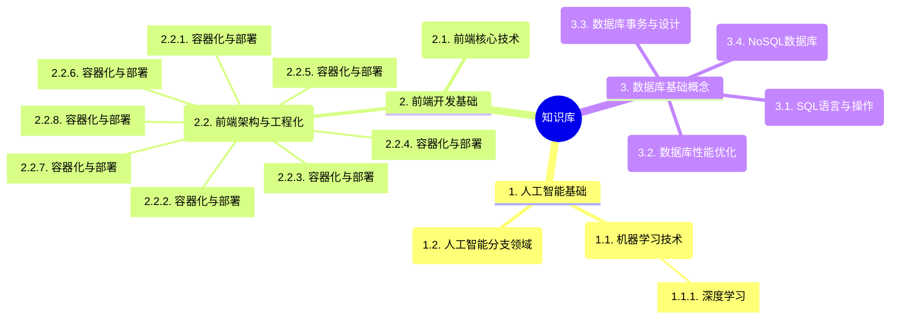
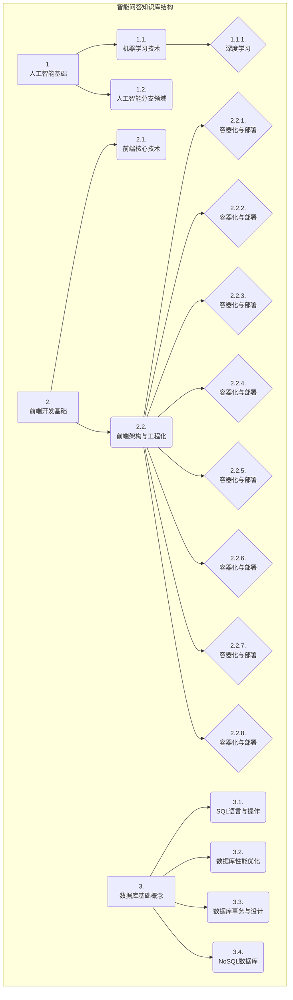

# 智能问答知识库结构图

基于 `chapter_structure.json` 生成的章节结构可视化图表。

## 📊 章节结构统计

| 层级 | 数量 | 描述 |
|------|------|------|
| 1 | 3 | 主要领域 |
| 2 | 8 | 技术分支 |
| 3 | 9 | 具体主题 |

**总章节数**: 20  
**问答条目数**: 45  
**最大层级**: 3  

## 🌲 层次结构流程图

```mermaid
flowchart TD
    %% 知识库章节结构图

    %% 节点定义
    chapter_1["1. 人工智能基础"]
    chapter_2("1.1. 机器学习技术")
    chapter_3{"1.1.1. 深度学习"}
    chapter_4("1.2. 人工智能分支领域")
    chapter_5["2. 前端开发基础"]
    chapter_6("2.1. 前端核心技术")
    chapter_7("2.2. 前端架构与工程化")
    chapter_8["3. 数据库基础概念"]
    chapter_9("3.1. SQL语言与操作")
    chapter_10("3.2. 数据库性能优化")
    chapter_11("3.3. 数据库事务与设计")
    chapter_12("3.4. NoSQL数据库")
    441b317d_0612_42b6_821e_ee0203f225ad{"2.2.1. 容器化与部署"}
    d19b1115_18e2_45f0_9b04_06feaaffa892{"2.2.2. 容器化与部署"}
    4a15de8d_81ff_42db_bffb_4c1bff266e57{"2.2.3. 容器化与部署"}
    912f8a10_a956_4604_a00e_99727f40d655{"2.2.4. 容器化与部署"}
    a24df3c7_3d89_48db_8e55_4177e9d42b0e{"2.2.5. 容器化与部署"}
    d3ee13c1_71bb_4d4e_890c_07eeeabd7b33{"2.2.6. 容器化与部署"}
    a38ef80a_692e_424b_aad3_80475e6846e4{"2.2.7. 容器化与部署"}
    cac9705c_d684_4c0b_8aa3_f7d61864701a{"2.2.8. 容器化与部署"}

    %% 层次关系
    chapter_1 --> chapter_2
    chapter_1 --> chapter_4
    chapter_2 --> chapter_3
    chapter_5 --> chapter_6
    chapter_5 --> chapter_7
    chapter_7 --> 441b317d_0612_42b6_821e_ee0203f225ad
    chapter_7 --> d19b1115_18e2_45f0_9b04_06feaaffa892
    chapter_7 --> 4a15de8d_81ff_42db_bffb_4c1bff266e57
    chapter_7 --> 912f8a10_a956_4604_a00e_99727f40d655
    chapter_7 --> a24df3c7_3d89_48db_8e55_4177e9d42b0e
    chapter_7 --> d3ee13c1_71bb_4d4e_890c_07eeeabd7b33
    chapter_7 --> a38ef80a_692e_424b_aad3_80475e6846e4
    chapter_7 --> cac9705c_d684_4c0b_8aa3_f7d61864701a
    chapter_8 --> chapter_9
    chapter_8 --> chapter_10
    chapter_8 --> chapter_11
    chapter_8 --> chapter_12

    %% 样式定义
    classDef level1 fill:#e1f5fe,stroke:#01579b,stroke-width:3px,color:#000
    classDef level2 fill:#f3e5f5,stroke:#4a148c,stroke-width:2px,color:#000
    classDef level3 fill:#fff3e0,stroke:#e65100,stroke-width:1px,color:#000

    %% 应用样式
    class chapter_1 level1
    class chapter_2 level2
    class chapter_3 level3
    class chapter_4 level2
    class chapter_5 level1
    class chapter_6 level2
    class chapter_7 level2
    class chapter_8 level1
    class chapter_9 level2
    class chapter_10 level2
    class chapter_11 level2
    class chapter_12 level2
    class 441b317d_0612_42b6_821e_ee0203f225ad level3
    class d19b1115_18e2_45f0_9b04_06feaaffa892 level3
    class 4a15de8d_81ff_42db_bffb_4c1bff266e57 level3
    class 912f8a10_a956_4604_a00e_99727f40d655 level3
    class a24df3c7_3d89_48db_8e55_4177e9d42b0e level3
    class d3ee13c1_71bb_4d4e_890c_07eeeabd7b33 level3
    class a38ef80a_692e_424b_aad3_80475e6846e4 level3
    class cac9705c_d684_4c0b_8aa3_f7d61864701a level3
```

## 🧠 思维导图

## 📋 树形结构图

## 📝 使用说明

### 图表说明
- **矩形框**: 一级章节（主要领域）
- **圆角框**: 二级章节（技术分支）
- **菱形框**: 三级章节（具体主题）

### 颜色含义
- **蓝色**: 一级章节（主要技术领域）
- **紫色**: 二级章节（细分技术方向）
- **橙色**: 三级章节（具体实现主题）

### 在线预览
可以将 mermaid 代码复制到以下平台进行在线预览：
- [Mermaid Live Editor](https://mermaid.live/)
- [GitHub Markdown](https://github.com) (原生支持)
- [GitLab](https://gitlab.com) (原生支持)

---
*生成时间: Unknown*
