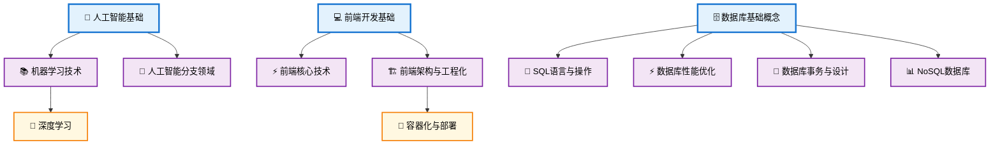
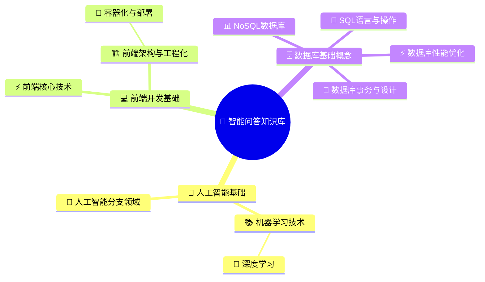
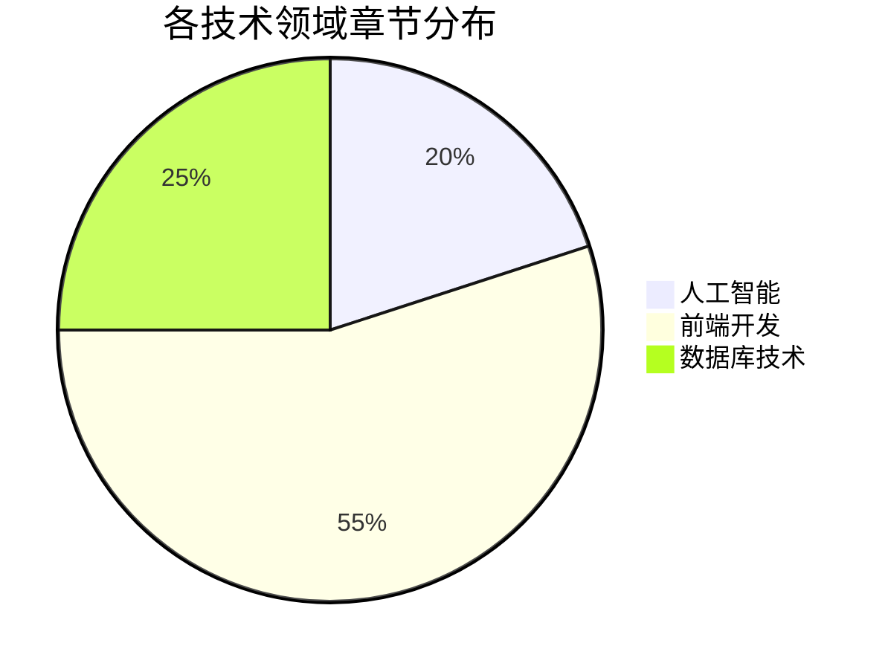

# 智能问答知识库结构图（简化版）

基于 `chapter_structure.json` 生成的简化版章节结构图。

## 📊 结构概览

- **3个主要领域**: 人工智能基础、前端开发基础、数据库基础概念
- **20个章节节点**: 包含3个层级的知识体系
- **45个问答条目**: 覆盖各技术领域的核心问题

## 🌲 知识库结构图

## 🧠 思维导图

## 📋 技术领域分布

## 🎯 使用指南

### 图表说明
- **🤖/💻/🗄️**: 主要技术领域（一级章节）
- **📚/⚡/🏗️**: 技术分支（二级章节）
- **🧠/🐳**: 具体主题（三级章节）

### 在线预览
将上述 mermaid 代码复制到 [Mermaid Live Editor](https://mermaid.live/) 可进行在线预览和编辑。

### 关键特点
1. **层次清晰**: 从领域 → 分支 → 主题的3层结构
2. **覆盖全面**: 涵盖AI、前端、数据库三大技术方向
3. **实用性强**: 每个节点都包含相关的问答知识点

---
*基于 chapter_structure.json 自动生成*