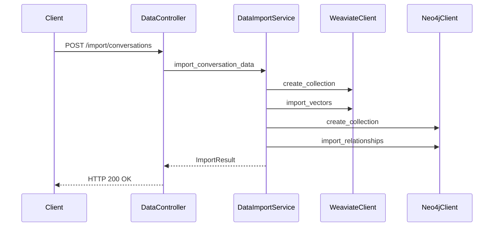
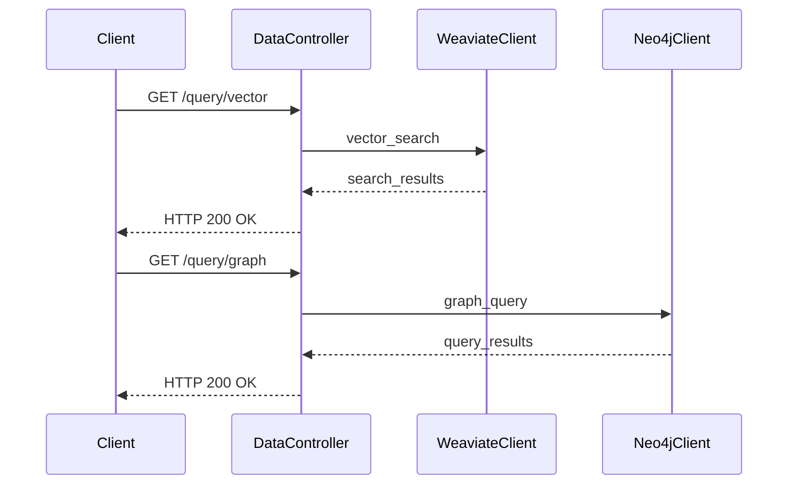

# AI知识库项目架构设计文档

## 1. 项目概述

本项目是一个基于DDD四层架构的AI知识库系统，严格按照需求实现以下4个核心功能：

1. **Weaviate Vector DB Client** (Infrastructure层) - 具有创建collection、导入数据、查询等功能
2. **Neo4j Graph DB Client** (Infrastructure层) - 具有创建collection、导入数据、查询等功能
3. **数据导入实体类** - 使用Pydantic实现，参考oss'pa案例，支持链式数据结构和历史追溯
4. **Docker部署环境** - Weaviate和Neo4j一键部署，数据目录挂载和gitignore配置

## 2. 架构设计

### 2.1 DDD四层架构

```
┌─────────────────────────────────────────┐
│              Interface Layer            │  
│  (API接口、控制器、DTO转换)                │
├─────────────────────────────────────────┤
│            Application Layer            │
│  (应用服务、用例编排、事务管理)              │
├─────────────────────────────────────────┤
│              Domain Layer               │
│  (实体、值对象、领域服务、仓储接口)          │
├─────────────────────────────────────────┤
│           Infrastructure Layer          │
│  (数据库客户端、外部服务、仓储实现)          │
└─────────────────────────────────────────┘
```

### 2.2 核心模块设计（简化版）

#### 2.2.1 Domain Layer (领域层)
- **核心实体类 (使用Pydantic)**
  - `ConversationRecord`: 对话记录实体（基于oss'pa案例结构）
  - `RecordChain`: 记录链条管理

#### 2.2.2 Application Layer (应用层)
- **核心服务**
  - `DataImportService`: 数据导入服务

#### 2.2.3 Infrastructure Layer (基础设施层)
- **数据库客户端（核心功能）**
  - `WeaviateClient`: Vector DB客户端 - 创建collection、导入数据、查询
  - `Neo4jClient`: Graph DB客户端 - 创建collection、导入数据、查询

#### 2.2.4 Interface Layer (接口层)
- **简化API**
  - `DataController`: 数据操作控制器

## 3. Pydantic实体类设计

### 3.1 ConversationRecord (对话记录实体)

基于oss'pa案例数据结构，使用Pydantic实现：

```python
from pydantic import BaseModel, Field
from typing import Optional, List, Set
from datetime import datetime
from uuid import UUID, uuid4
from enum import Enum

class ConversationRecord(BaseModel):
    """对话记录实体 - 基于oss'pa案例结构"""
    record_id: UUID = Field(default_factory=uuid4, description="记录唯一标识")
    sequence_number: int = Field(description="序号 (No.)")
    user_input: str = Field(description="用户输入")
    current_state: str = Field(description="当前状态 (s)")
    next_state: Optional[str] = Field(default=None, description="下一状态 (s')")
    prompt: str = Field(description="提示词")
    agent_output: str = Field(description="代理输出")
    
    # 链式结构支持
    previous_record_id: Optional[UUID] = Field(default=None, description="上一条记录ID")
    next_record_id: Optional[UUID] = Field(default=None, description="下一条记录ID")
    
    created_at: datetime = Field(default_factory=datetime.now)
    updated_at: datetime = Field(default_factory=datetime.now)
    
    class Config:
        json_encoders = {
            datetime: lambda v: v.isoformat(),
            UUID: lambda v: str(v)
        }
    
    def link_previous(self, previous_record: 'ConversationRecord') -> None:
        """链接到上一条记录"""
        self.previous_record_id = previous_record.record_id
        previous_record.next_record_id = self.record_id
    
    def link_next(self, next_record: 'ConversationRecord') -> None:
        """链接到下一条记录"""
        self.next_record_id = next_record.record_id
        next_record.previous_record_id = self.record_id

class RecordChain(BaseModel):
    """记录链条管理"""
    chain_id: UUID = Field(default_factory=uuid4)
    records: List[ConversationRecord] = Field(default_factory=list)
    
    def add_record(self, record: ConversationRecord) -> None:
        """添加记录到链条"""
        if self.records:
            self.records[-1].link_next(record)
        self.records.append(record)
    
    def get_history_from(self, record_id: UUID) -> List[ConversationRecord]:
        """从指定记录获取历史链条"""
        history = []
        for record in self.records:
            if record.record_id == record_id:
                # 向前追溯历史
                current = record
                while current and current.previous_record_id:
                    prev_record = next((r for r in self.records if r.record_id == current.previous_record_id), None)
                    if prev_record:
                        history.insert(0, prev_record)
                        current = prev_record
                    else:
                        break
                history.append(record)
                break
        return history
```

## 4. Docker部署配置

### 4.1 docker-compose.yml

```yaml
version: '3.8'

services:
  weaviate:
    image: semitechnologies/weaviate:1.32.2
    ports:
      - "8855:8080"
    environment:
      QUERY_DEFAULTS_LIMIT: 25
      AUTHENTICATION_ANONYMOUS_ACCESS_ENABLED: 'true'
      PERSISTENCE_DATA_PATH: '/var/lib/weaviate'
      DEFAULT_VECTORIZER_MODULE: 'none'
      ENABLE_MODULES: 'text2vec-openai,generative-openai'
      CLUSTER_HOSTNAME: 'node1'
    volumes:
      - ./weaviate_db_data:/var/lib/weaviate
    restart: on-failure:0

  neo4j:
    image: neo4j:5.26.10
    ports:
      - "7474:7474"
      - "7687:7687"
    environment:
      NEO4J_AUTH: neo4j/password
      NEO4J_PLUGINS: '["apoc"]'
      NEO4J_dbms_security_procedures_unrestricted: 'apoc.*'
    volumes:
      - ./neo4j_db_data:/data
      - ./neo4j_db_data/logs:/logs
      - ./neo4j_db_data/import:/var/lib/neo4j/import
      - ./neo4j_db_data/plugins:/plugins
    restart: unless-stopped
```

### 4.2 .gitignore配置

```gitignore
# 数据库数据目录
weaviate_db_data/
neo4j_db_data/

# Python
__pycache__/
*.py[cod]
*$py.class
*.so
.Python
build/
develop-eggs/
dist/
downloads/
eggs/
.eggs/
lib/
lib64/
parts/
sdist/
var/
wheels/
*.egg-info/
.installed.cfg
*.egg

# 环境
.env
.venv
env/
venv/
ENV/
env.bak/
venv.bak/

# IDE
.vscode/
.idea/
*.swp
*.swo

# 测试
.coverage
.pytest_cache/
htmlcov/

# uv
.uv/
```

## 5. 核心功能时序图

### 5.1 数据导入流程



### 5.2 数据查询流程



## 6. 数据库设计

### 6.1 Weaviate Schema

```python
WEAVIATE_SCHEMA = {
    "class": "ConversationRecord",
    "description": "对话记录向量存储",
    "properties": [
        {
            "name": "recordId",
            "dataType": ["string"],
            "description": "记录ID"
        },
        {
            "name": "userInput",
            "dataType": ["text"],
            "description": "用户输入"
        },
        {
            "name": "agentOutput", 
            "dataType": ["text"],
            "description": "代理输出"
        },
        {
            "name": "currentState",
            "dataType": ["string"],
            "description": "当前状态"
        },
        {
            "name": "nextState",
            "dataType": ["string"],
            "description": "下一状态"
        }
    ],
    "vectorizer": "text2vec-openai"
}
```

### 6.2 Neo4j Graph Schema

```cypher
// 对话记录节点
CREATE CONSTRAINT conversation_record_id IF NOT EXISTS FOR (c:ConversationRecord) REQUIRE c.recordId IS UNIQUE;

// 状态节点
CREATE CONSTRAINT state_name IF NOT EXISTS FOR (s:State) REQUIRE s.name IS UNIQUE;

// 关系定义
(:ConversationRecord)-[:NEXT_RECORD]->(:ConversationRecord)
(:ConversationRecord)-[:PREVIOUS_RECORD]->(:ConversationRecord)
(:ConversationRecord)-[:IN_STATE]->(:State)
(:State)-[:TRANSITIONS_TO]->(:State)
```

## 7. 技术栈

- **语言**: Python 3.12
- **包管理**: Poetry
- **环境管理**: uv
- **向量数据库**: Weaviate
- **图数据库**: Neo4j
- **数据验证**: Pydantic
- **测试框架**: pytest
- **类型检查**: mypy

## 8. 项目结构

```
ai_knowledge_base/
├── src/
│   ├── ai_knowledge_base/
│   │   ├── domain/
│   │   │   ├── entities/
│   │   │   ├── value_objects/
│   │   │   ├── repositories/
│   │   │   └── services/
│   │   ├── application/
│   │   │   ├── services/
│   │   │   └── use_cases/
│   │   ├── infrastructure/
│   │   │   ├── database/
│   │   │   ├── repositories/
│   │   │   └── clients/
│   │   └── interface/
│   │       ├── api/
│   │       ├── controllers/
│   │       └── dto/
├── tests/
├── docs/
├── pyproject.toml
├── uv.lock
└── README.md
```

## 9. 开发计划

1. **第一阶段**: 搭建基础架构和实体类
2. **第二阶段**: 实现数据库客户端
3. **第三阶段**: 实现应用服务和用例
4. **第四阶段**: 实现API接口
5. **第五阶段**: 编写测试和文档

## 10. 质量保证

- **测试覆盖率**: 100%
- **代码质量**: 使用mypy进行类型检查
- **文档**: 完整的API文档和架构文档
- **性能**: 向量检索和图查询性能优化

## 8. 数据库客户端接口设计

### 8.1 WeaviateClient接口

```python
from abc import ABC, abstractmethod
from typing import List, Dict, Any, Optional

class WeaviateClient:
    """Weaviate向量数据库客户端"""
    
    def __init__(self, url: str = "http://localhost:8855"):
        self.url = url
        self.client = None
    
    def create_collection(self, collection_name: str, schema: Dict[str, Any]) -> bool:
        """创建collection"""
        pass
    
    def import_data(self, collection_name: str, data: List[Dict[str, Any]]) -> bool:
        """导入数据"""
        pass
    
    def query(self, collection_name: str, query_vector: List[float], limit: int = 10) -> List[Dict[str, Any]]:
        """查询数据"""
        pass
```

### 8.2 Neo4jClient接口

```python
class Neo4jClient:
    """Neo4j图数据库客户端"""
    
    def __init__(self, uri: str = "bolt://localhost:7687", user: str = "neo4j", password: str = "password"):
        self.uri = uri
        self.user = user
        self.password = password
        self.driver = None
    
    def create_collection(self, collection_name: str) -> bool:
        """创建collection（在Neo4j中相当于创建节点标签）"""
        pass
    
    def import_data(self, nodes: List[Dict[str, Any]], relationships: List[Dict[str, Any]]) -> bool:
        """导入节点和关系数据"""
        pass
    
    def query(self, cypher_query: str, parameters: Dict[str, Any] = None) -> List[Dict[str, Any]]:
        """执行Cypher查询"""
        pass
```

## 11. 简化项目结构

```
ai_knowledge_base/
├── src/
│   └── ai_knowledge_base/
│       ├── domain/
│       │   └── entities.py          # Pydantic实体类
│       ├── infrastructure/
│       │   ├── weaviate_client.py   # Weaviate客户端
│       │   └── neo4j_client.py      # Neo4j客户端
│       ├── application/
│       │   └── services.py          # 应用服务
│       └── interface/
│           └── api.py               # API接口
├── tests/
│   ├── test_entities.py
│   ├── test_weaviate_client.py
│   ├── test_neo4j_client.py
│   └── test_services.py
├── docker-compose.yml               # Docker部署配置
├── .gitignore                       # Git忽略文件
├── pyproject.toml                   # Poetry配置
├── README.md
└── docs/
    └── architecture_design.md
```

## 12. 核心依赖包

```toml
[tool.poetry.dependencies]
python = "^3.12"
pydantic = "^2.5.0"
weaviate-client = "^3.25.0"
neo4j = "^5.13.0"
fastapi = "^0.104.0"
uvicorn = "^0.24.0"

[tool.poetry.group.dev.dependencies]
pytest = "^7.4.0"
pytest-cov = "^4.1.0"
mypy = "^1.7.0"
black = "^23.11.0"
isort = "^5.12.0"
```

## 13. 开发阶段

1. **环境搭建**: 初始化uv + poetry环境，创建项目结构
2. **Docker部署**: 配置Weaviate和Neo4j容器
3. **实体类实现**: 基于Pydantic实现ConversationRecord等实体
4. **数据库客户端**: 实现Weaviate和Neo4j客户端的核心功能
5. **应用服务**: 实现数据导入服务
6. **API接口**: 实现简化的REST API
7. **测试**: 编写单元测试，确保100%覆盖率
8. **集成测试**: 测试各功能接口