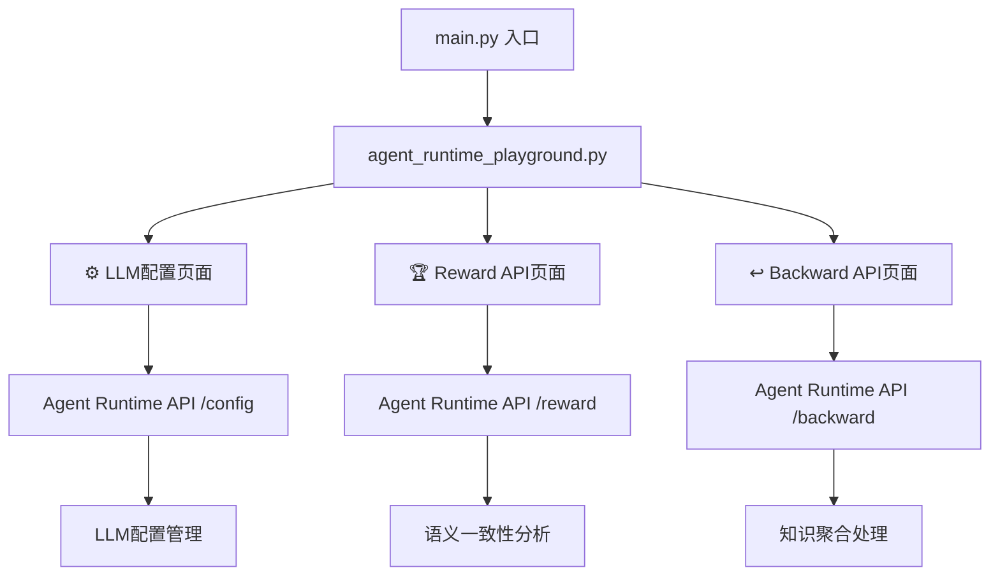

# Agent Runtime Playground 实现计划

## 项目概述

为 agent_runtime 的 API 创建一个基于 Streamlit 的前端 playground，提供直观的界面来测试和使用以下三个主要 API：

1. **LLM 配置管理** - GET/POST `/config`
2. **Reward API** - POST `/reward` (语义一致性比较)
3. **Backward API** - POST `/backward` (问答对聚合处理)

## 架构设计



## 文件结构

```
playground/
├── agent_runtime_playground.py    # 主要功能实现
├── main.py                       # Streamlit 入口文件
├── pyproject.toml               # 项目依赖配置
├── README.md                    # 使用说明
└── implementation_plan.md       # 本实现计划
```

## 功能详细设计

### 1. LLM 配置管理页面 (⚙️)

**核心功能：**
- 显示当前 LLM 配置状态
- 提供配置表单界面
- 支持预设配置模板（DeepSeek、OpenAI等）
- 实时配置验证和更新

**UI 组件：**
- API URL 输入框（可配置）
- 配置状态显示区域
- 配置表单（API Key、模型、Base URL、超时等）
- 预设模板选择器
- 保存配置按钮

**API 交互：**
- GET `/config` - 获取当前配置
- POST `/config` - 更新配置

### 2. Reward API 测试页面 (🏆)

**核心功能：**
- 语义一致性比较测试
- 支持预设示例和自定义输入
- 结果可视化展示
- 测试历史记录

**UI 组件：**
- 问题输入框
- 候选答案列表编辑器
- 目标答案输入框
- 预设示例选择器
- 结果展示区域（分数、分析等）
- 测试历史

**API 交互：**
- POST `/reward` - 执行语义比较

### 3. Backward API 测试页面 (↩️)

**核心功能：**
- 问答对批量处理
- 章节聚合结果展示
- OSPA 格式数据导出
- 处理过程可视化

**UI 组件：**
- 问答对输入界面（支持CSV上传）
- 额外指令配置
- 处理结果展示（章节、OSPA数据）
- 统计信息显示
- 结果导出功能

**API 交互：**
- POST `/backward` - 执行知识聚合处理

## 技术实现要点

### 1. 状态管理
- 使用 `st.session_state` 管理 API URL 配置
- 缓存 LLM 配置状态
- 保持测试历史记录

### 2. 错误处理
- API 连接状态检查
- 详细错误信息显示
- 优雅的异常处理

### 3. 用户体验
- 响应式布局设计
- 加载状态指示器
- 操作结果反馈
- 数据可视化展示

### 4. 数据格式处理
- JSON 数据美化显示
- CSV 文件上传和解析
- 结果数据导出

## 依赖项

```toml
[project]
dependencies = [
    "streamlit>=1.43.1,<2.0.0",
    "requests>=2.32.3,<3.0.0", 
    "pandas>=2.0.0,<3.0.0",
    "pydantic>=2.10.6,<3.0.0"
]
```

## 开发步骤

1. ✅ 分析 API 结构和需求
2. ✅ 设计界面布局和架构
3. 🔄 创建项目配置文件
4. 🔄 实现主入口文件
5. 🔄 实现 LLM 配置管理功能
6. 🔄 实现 Reward API 测试功能
7. 🔄 实现 Backward API 测试功能
8. 🔄 创建使用说明文档
9. 🔄 完整功能测试

## API 端点说明

### Config API
- **GET /config** - 获取当前 LLM 配置
- **POST /config** - 更新 LLM 配置

### Reward API
- **POST /reward** - 语义一致性比较
  - 输入：问题、候选答案列表、目标答案
  - 输出：RewardResult（分数、分析等）

### Backward API  
- **POST /backward** - 问答对聚合处理
  - 输入：问答对列表、额外指令
  - 输出：章节结构、OSPA数据、统计信息

## 使用场景

1. **开发测试** - API 功能验证和调试
2. **演示展示** - 产品功能演示
3. **用户体验** - 非技术用户的友好界面
4. **数据处理** - 批量知识处理工具

这个计划提供了完整的实现蓝图，确保最终产品既功能完整又用户友好。